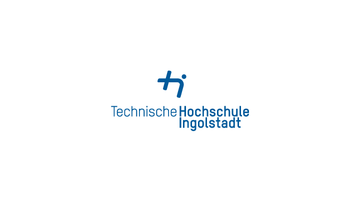
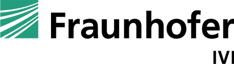
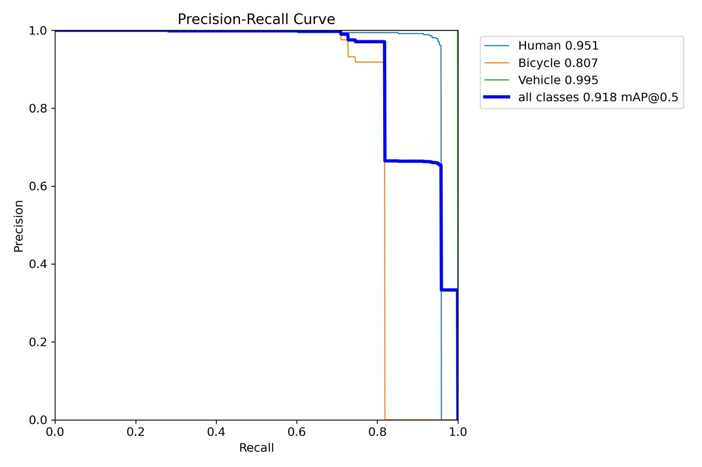
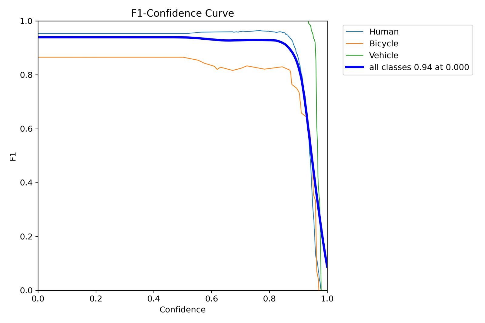
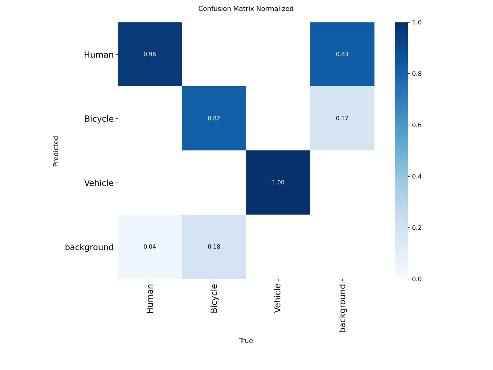
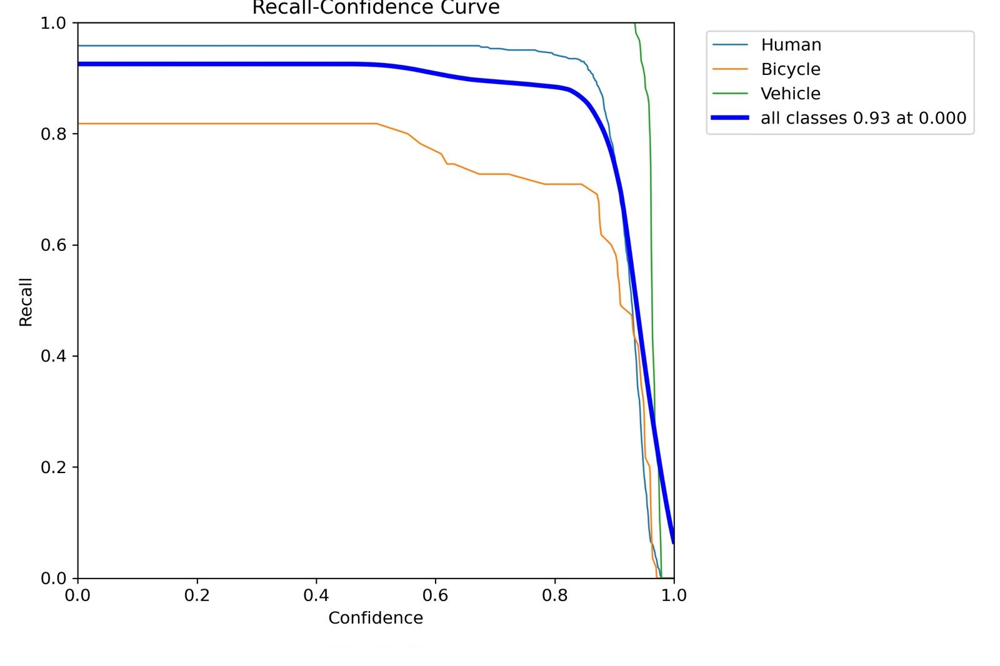

# 🚁 Ariel Project — Low-Altitude Aerial Object Detection (3–9m)

> Fine-tuned YOLOv8n model for robust object detection in drone footage captured at 3–9 meter altitude — a range critically underrepresented in existing datasets like VisDrone and UAVDT.

<br>

## 🤝 Collaboration

<table>
  <tr>
    <td align="center" width="33%">
      <br/>
      <a href="https://www.thi.de"></a>
      <br/><br/>
      <b>Technische Hochschule Ingolstadt</b><br/>
      <sub>Research Guidance & Supervision</sub>
      <br/>
    </td>
    <td align="center" width="33%">
      <br/>
      <a href="https://www.ivi.fraunhofer.de"></a>
      <br/><br/>
      <b>Fraunhofer IVI</b><br/>
      <sub>Industry Mentorship & Data Provision</sub>
      <br/>
    </td>
    <td align="center" width="33%">
      <br/>
      <a href="https://www.th-deg.de"></a>
      <br/><br/>
      <b>Technische Hochschule Deggendorf</b><br/>
      <sub>Student Project Team</sub>
      <br/>
    </td>
  </tr>
</table>

<br>


---

## 📌 Overview

Existing aerial datasets (VisDrone, UAVDT) are designed for flights above 30 meters, leading to missed detections, poor localization accuracy, and high false positives at low altitudes. This project addresses that gap by:

- Building a **custom annotated dataset** from real drone footage at 3–9m across 4 distinct scenes
- Fine-tuning **YOLOv8n** on this dataset using aerial-specific hyperparameter tuning
- Achieving **91.8% mAP@0.5** on a held-out 10% test split
- Running at **2.3 ms inference** per image — suitable for real-time deployment

<br>

https://github.com/user-attachments/assets/6bf30f82-0f2c-4328-b598-dad79f8f0d81
> *YOLOv8n · 2x speed · conf=0.50*

---

## 📊 Results

### Overall Performance

| Metric | Value |
|---|---|
| **mAP@0.5** | **0.918** |
| **mAP@0.5:0.95** | **0.850** |
| **Precision** | **0.956** |
| **Recall** | **0.926** |
| **F1 Score** | **0.94** |
| Inference Speed | 2.3 ms / image |

### Per-Class Breakdown

| Class | Images | Instances | Precision | Recall | mAP@0.5 | mAP@0.5:0.95 |
|---|---|---|---|---|---|---|
| **All** | 231 | 501 | 0.956 | 0.926 | **0.918** | 0.850 |
| Human | 188 | 385 | 0.949 | 0.958 | 0.951 | 0.845 |
| Bicycle | 34 | 55 | 0.918 | 0.818 | 0.807 | 0.713 |
| Vehicle | 61 | 61 | 1.000 | 1.000 | 0.995 | 0.993 |

> Bicycle scores lower due to class imbalance (597 instances vs 3,642 Human). Vehicle achieves perfect precision and recall — visually distinct from top-down perspective.

### Evaluation Curves

<p align="center">
  
  
</p>
<p align="center">
  
  
</p>

---

## 🗂️ Dataset

| Metric | Value |
|---|---|
| Total Annotations | 4,776 |
| Frames Labeled | 2,227 |
| Video Sequences | 10 |
| Distinct Scenes | 4 |
| Negative Samples | ~15% |
| Format | YOLO (.txt) |
| Dataset Split | 80% train / 10% val / 10% test |

| Class ID | Name | Count | Share |
|---|---|---|---|
| 0 | Human | 3,642 | 76.2% |
| 1 | Bicycle | 597 | 12.5% |
| 2 | Vehicle | 537 | 11.2% |

Annotations were created using **[Roboflow](https://roboflow.com/)** with strict labeling rules: tight bounding boxes, shadows excluded, occlusion threshold ≥20%, and ~15% negative samples to reduce false positives.

---

## 🛠️ Model & Training

- **Model:** YOLOv8n — optimized for edge/drone devices
- **Base weights:** COCO pretrained (`yolov8n.pt`)
- **Platform:** Google Colab (T4 GPU)
- **Export:** ONNX

```python
model.train(
    data="./unified_dataset_80_10_10/data.yaml",
    epochs=150, imgsz=640, batch=16,
    patience=15,     # early stopping
    box=7.5,         # strict bounding box loss
    cls=1.5,         # classification weight
    cos_lr=True,     # cosine LR decay
)
```

---

## 🚀 Quick Start

```bash
git clone https://github.com/BUAksakal/low-altitude-aerial-detection.git
cd low-altitude-aerial-detection
pip install -r requirements.txt
```

```bash
python train.py   # fine-tune
python test.py    # evaluate on test split
```

---

## 📄 License

Academic research project — THI × Fraunhofer IVI × THD collaboration, SS26.
